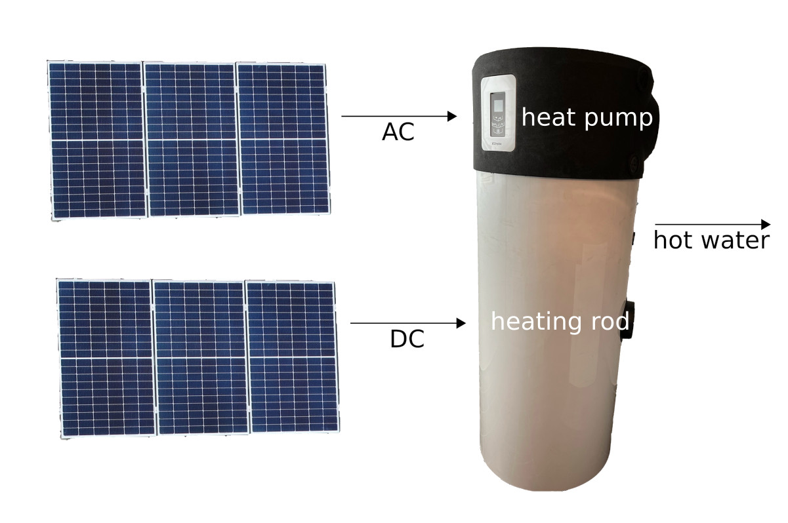

# DimplexDHW_4PV

This is about the combination of a domestic hot water heat pump and photovoltaic. My hot water heat pump is a Dimplex DHW 300+, but the hacks may also work for other DHW models (probably DHW 250P, DHW 300, DHW 300+, DHW 300D, DHW 300D+, DHW 301P, DHW 301P+, DHW 400+). The goal is to maximize the green energy share, and to have fun making things "smart".

Note that there are simpler solutions. This project is also for fun, not plain efficiency. The Dimplex device offers time-dependent temperature settings, which should suffice to reschedule most of the power consumption to times of pv yield, without extra wiring. And it offers a "smart grid digital input" for even better adaption to e.g. real pv yield, requiring only a single cable to the pv system. And Dimplex offers [PV OPT](https://dimplex.de/presse/news/pv-optimizer) as another option.

Disclaimer: Dimplex is a registered trademark of Glen Dimplex UK Limited. I am not affiliated to Glen Dimplex, I am an end user. No more, no less. All my proposals are offered in the hope they may be useful. In doubt, refer to official sources only and do not modify anything. **Danger to life from electric current!**

## Similar projects and starting points 

During my search for a hot water heat pump I found some officially-looking information about Modbus on the Dimplex DHW on dimplex.de, which I rated as a big plus for the Dimplex. Unfortunately the original page disappeared later, but it is still available on [archive.org](https://web.archive.org/web/20210513144740/http://www.dimplex.de/wiki/index.php/DHW_Modbus_RTU). Furthermore you can find the complete [Installation and User Manual](https://dimplex.de/sites/default/files/downloads/Dimplex_Montageanweisung_4519056601_a_FD0102_DHW300_300_dim.pdf) online, and even [electrical documentation](https://dimplex.de/sites/default/files/DHW_300plus_Elektrodokumentation.pdf) (linked from [dimplex.de](https://dimplex.de/dimplex/warmwasser/warmwasser-waermepumpen/dhw-300plus)). Awesome! 

A distinction: We do *not* need additional Dimplex-specific hardware. We do *not* need [~~NWPM extension for ModbusTCP~~](https://dimplex.atlassian.net/wiki/spaces/DW/pages/2900361221/NWPM+Modbus+TCP+EN) or [~~Dimplex's PV-Optimizer~~](https://www.dimplex-partner.de/media/Montageanweisungen_SYS/5_Zubehoer/dimplex_PV-Opt_fd9907_de.pdf). 

A distinction: This project deals with wires and other low-layer communication. If you expect to see out-of-the-box pretty visualization or generic home automation integration, you may be disappointed. But there seem to be a few interesting other projects, e.g. for [ioBroker](https://forum.iobroker.net/topic/52800/welche-brauchwasserw%C3%A4rmepumpe-mit-iobroker/7?lang=en-US), [loxone](https://www.loxforum.com/forum/verkabelung-installation/273973-pv-anlage-mit-speicher-fronius-gen24-u-dimplex-warmwasser-w%C3%A4rmepumpe), [Symcon](https://community.symcon.de/t/modbus-rtu-auf-tcp/122536), [FHEM](https://forum.fhem.de/index.php?topic=75638.465), [NodeRED](https://kaloon.ch/2019/03/challenge-dimplex-dhw-300-brauchwasser-waermepumpe-modbus-rtu/), [HomeAssistant](https://github.com/ChristophCaina/ha-dimplex-heatpump-modbus), or (though for different Dimplex hardware) [ioBroker](https://forum.iobroker.net/topic/5755/frage-dimplex-w%C3%A4rmepumpe-temperaturen-%C3%BCber-modbus-auslesen), [SmartHomeNG](https://github.com/chrpuf/smarthomeNG-DimplexWP), or (not Dimplex-specific:) [clever-PV](https://www.clever-pv.com/w%C3%A4rmepumpe-pv-sg-ready), [openWB](https://openwb.de/forum/viewtopic.php?t=2118), [when2heat](https://github.com/oruhnau/when2heat), [waterheatertimer.org](http://waterheatertimer.org/Convert-AC-water-heater-to-DC-water-heater.html#best-design). At first sight none of them was exactely what I was looking for, but nonetheless these projects may be great sources of ideas or implementation hints.

## Energy Counting

To learn about our energy consumption (here: for hot water), and determine the green share, we need to collect data.

I do not have a thermal energy meter, so I do not count energy leaving the Dimplex. My approach is to count the energy that flows into the Dimplex to heat water. The internal heat exchanger is not used, so this is electrical energy only.

On the AC side, we can use e.g. a modbus electricity meter. I chose a Phoenix EM357. It is a 3 phase power meter, of which 1 phase (or call it channel) is used for this project. A script polls the relevant registers, making use of a ModbusRTU/RS485 to ModbusTCP/Ethernet Converter.

On the DC side, I use [direct-pv2heat-meter](https://github.com/makischu/direct-pv2heat-meter). Also here, a server script receives data.

On the AC side, the Dimplex's consumption is not the only of interest. We also can make use of inverter or grid data.

Collected data is formatted as [JSON](https://en.wikipedia.org/wiki/JSON) and published via [MQTT](https://en.wikipedia.org/wiki/MQTT). Further processing (even logging to file) is completely separated. 

## Dimplex's 1bit photovoltaic function

"For the photovoltaic function, the terminal X8 must be fed with 230 V 50 Hz. [...] If the photovoltaic input is active, the heat pump controls to the setpoint for the PV
mode." [Manual]. Set point is the desired water temperature, which is higher when the pv "bit" is active.

To set this bit, I use a [Shelly 1](https://www.shelly.cloud/de/products/shop/1xs1). For test purposes you can use it as a timer, but the benefit for this project is its ability to act as a software-controllable remote switch.

## Dimplex's communication interface

According to the [electrical documentation](https://dimplex.de/sites/default/files/DHW_300plus_Elektrodokumentation.pdf), the Dimplex incorporates an "RS485" interface, for a "Building management system" to be connected via 2-wire "data-cable; shielded". According to the formerly available [dimplex.de wiki (archived)](https://web.archive.org/web/20210513144740/http://www.dimplex.de/wiki/index.php/DHW_Modbus_RTU), the connector is "RJ12" and the protocol is "ModbusRTU". Reading operating states and changing settings shall be possible.

Also I found useful hints in a [forum](https://community.symcon.de/t/modbus-rtu-auf-tcp/122536/44). And while the official wiki disappeared, valuable information was posted there, also linking to another [forum](https://forum.iobroker.net/topic/65100/anleitung-dimplex-w%C3%A4rmepumpe-%C3%BCber-modbus-verbinden). And I got hints from my seller.

## To be continued.

